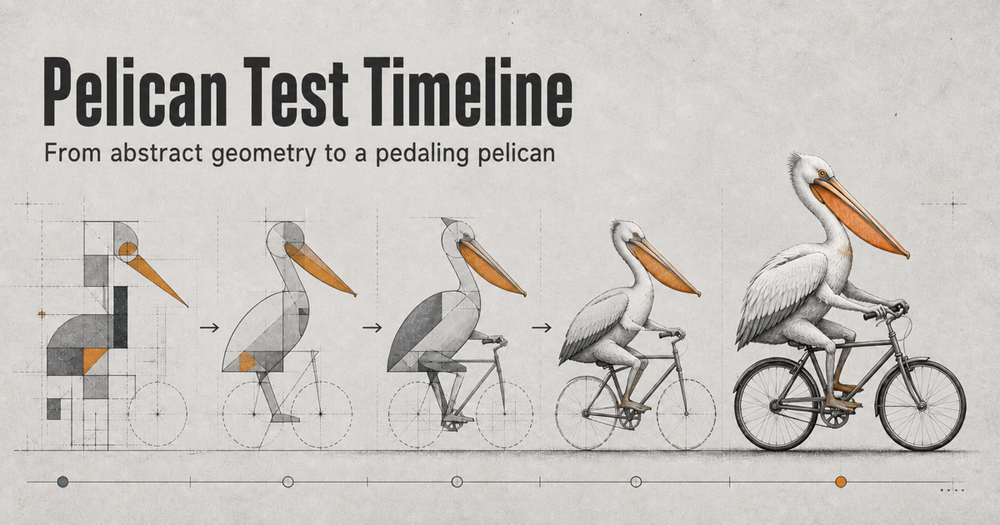

**English** | [简体中文](./README.zh-CN.md)

# Pelican Test

> This site is primarily based on Simon Willison's [Pelican riding a bicycle](https://simonwillison.net/tags/pelican-riding-a-bicycle/) series and the original posts referenced there. Each timeline entry retains links to its sources; all results remain the property of their original authors and publishers.



Use the same SVG prompt to browse how different language models rendered “a pelican riding a bicycle” from 2024 to 2026.

The site organizes traceable images, videos, and original sources into a timeline with year filters, a before-and-after comparison, enlarged image previews, and light and dark themes. It offers an intuitive view of changes in object rendering, structure, and spatial relationships, but is not a systematic benchmark or model leaderboard.

## Run locally

Node.js 22.13 or later is required.

```bash
npm install
npm run dev
```

Open the local URL shown in the terminal.

The Chinese page is at `/`; the English page is at `/en/`. Each URL is exported
with its own language and sharing metadata. The language selector navigates between them.

The personal test collection is at `/my-tests/` (Chinese) and `/en/my-tests/` (English).
Each card includes a thumbnail, model, test date, and original prompt, and opens the complete demo in a new tab.

## Commands

```bash
npm run dev    # Start the development server
npm run build  # Create a production build
npm run start  # Start the production server
npm run lint   # Check the code
npm test       # Check preferences, content, assets, and translations
npm run check  # Run lint, type checking, tests, and the production build
```

## Maintaining content

- Timeline data and source links: `app/content/milestones.ts`
- Personal test records: `app/content/my-tests.ts`
- Original personal test demos and thumbnails: `public/my-tests/`
- English translations: `app/content/translations.ts`
- Page interactions: `app/home.tsx`
- Test images and videos: `public/pelicans/`
- Page styles: `app/globals.css`
- Page metadata and document layout: `app/site-layout.tsx`
- Social previews: `public/og.png` (Chinese) and `public/og-en.png` (English)

Run `npm run check` after changing content. It checks dates, ordering, local assets,
source-link format, and English translation coverage; it does not verify external page availability.

### Add a personal test

1. Place the original HTML, its assets, and a thumbnail in `public/my-tests/<test-id>/`.
2. Add a record to `myTests` in `app/content/my-tests.ts`, ordered newest first. Include its date, model, title, description, original prompt, thumbnail, and demo path.
3. Add English translations for the title, description, and thumbnail alt text in `app/content/translations.ts`. Preserve the original prompt and demo content verbatim.

The first test is `2026-09-12-gpt-6-astra-max`, dated 2026-09-12 and generated with GPT-6-Astra-Max, from the Codex task “创建鹈鹕骑车SVG动画”. Adding records does not require layout changes.
