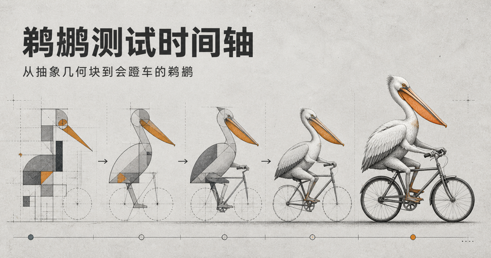

[English](./README.md) | **简体中文**

# Pelican Test

> 内容主要整理自 Simon Willison 的 [Pelican riding a bicycle](https://simonwillison.net/tags/pelican-riding-a-bicycle/) 系列记录及其引用的原始发布。每个时间轴节点均保留对应来源链接；结果版权归原作者与发布者所有。



用同一句 SVG 提示词，按时间浏览 2024 至 2026 年不同大模型生成“鹈鹕骑自行车”的实际结果。

站点以时间轴整理可追溯的图片、视频和原始来源，并提供年份筛选、前后效果对比、图片放大预览及明暗主题。它适合直观感受模型在对象、结构和空间关系上的变化，不作为系统评测或模型排行榜。

## 本地运行

需要 Node.js 22.13 或更高版本。

```bash
npm install
npm run dev
```

启动后访问终端中显示的本地地址。

中文页面位于 `/`，英文页面位于 `/en/`。两个地址分别导出对应语言的正文与分享元数据，语言选择器用于切换页面。

## 常用命令

```bash
npm run dev    # 启动开发环境
npm run build  # 构建生产版本
npm run start  # 启动生产版本
npm run lint   # 检查代码
npm test       # 检查偏好设置、内容、资源和翻译
npm run check  # 运行 lint、类型检查、测试和生产构建
```

## 内容维护

- 时间轴数据与来源链接：`app/content/milestones.ts`
- 英文翻译：`app/content/translations.ts`
- 页面交互：`app/home.tsx`
- 测试图片与视频：`public/pelicans/`
- 页面样式：`app/globals.css`
- 页面元数据与文档布局：`app/site-layout.tsx`
- 社交分享图：`public/og.png`（中文）、`public/og-en.png`（英文）

修改内容后运行 `npm run check`。检查覆盖日期、排序、本地资源、来源链接格式及英文翻译完整性，不验证外部页面是否可访问。
